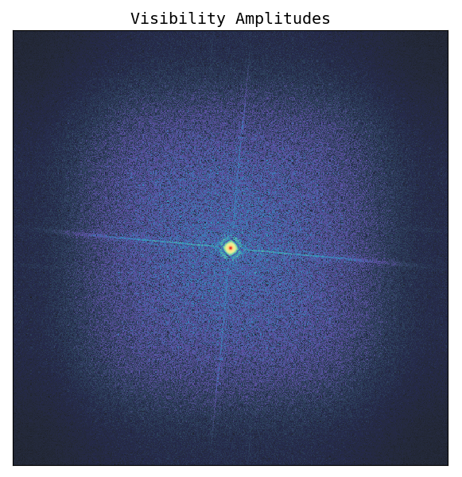
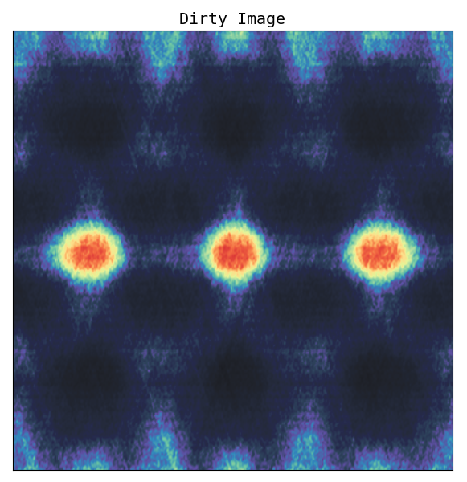
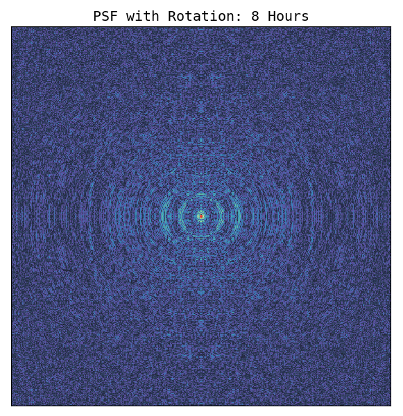

## Imaginary Interferometer
A simulated radio interferometer to build an intuitive understanding of the functioning of large radio interferometric arrays.

### Usage

Clone this repository into a directory of your choice.  

```
cd ~\Documents
git clone https://github.com/amanchokshi/imaginary-interferometer.git
cd imaginary-interferometer
source setup.sh
```

`source setup.sh` creates a python virtual environment called `venv`, activates it, and installs all the required packages.  

To get and idea of the options available:  
```
python interferometer.py --help
```

The Imaginary Inteferometer can be run with its default settings with:   
```
python interferometer.py
```

To deactivate the python virtual environment, type `deactivate` in your terminal.   


The code has a lot of comments which will help you understand the fundamentals of interferometry. You can add new images to the `images` directory, but the must be `512x512` pixels in dimension. Images can be used with the `--image` flag. New arrays can be defined in the `array` directory, and used with the `--array` flag.


### Introduction to Interferometry

The image on the left of a star field is our imaginary "Sky" for the purpose of this excercise. Taking the 2D fourier transform of this "sky", results in the image on the right. These represent the "Visibility Amplituded" or the "U-V" plane.  




The dirty images produced by the imaginary interferometer, with and without rotation synthesis.  




The PSF (Point Spread Function) of the array with and without rotation synthesis.  




Array configuration, UV sampling instantaneous snapshot, and UV sampling with rotation synthesis.  


